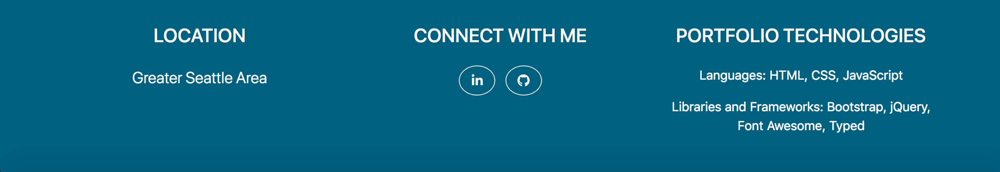

# Software Developer Portfolio
Website for people to see samples of my software applications and get to know a little bit about me.

**Author**: Earl Jay Caoile  
**Version**: 1.0.0

## Overview
This front end web applications serves as a portfolio for users to view my past projects and  connect with me.

## Getting Started
The following is required to run the program.
1. Visual Studio Code or any other code editor.
2. An internet connection.
3. A web browser to view the contents.

## Visuals
  
  
  
  

## Happy path
- open html file in a browser
- look at contents
- smile

## Architecture
This application is created pure with front end development languages and tools.  
*Languages*: HTML, CSS, JavaScript  
*Libraries and Frameworks*: Bootstrap, jQuery, Typed, Font Awesome  
*Type of Application*: Web Application  
